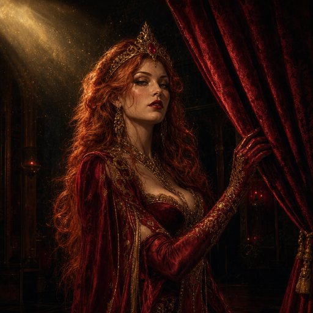
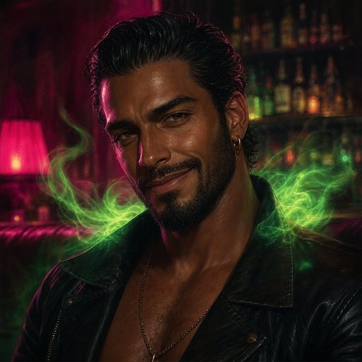
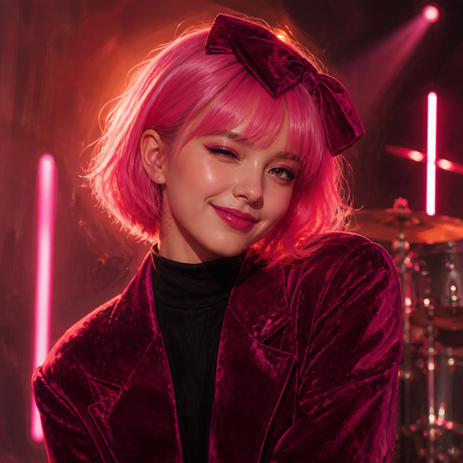
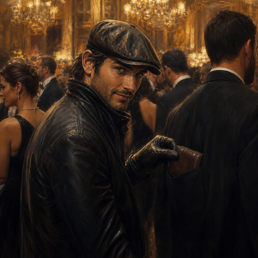
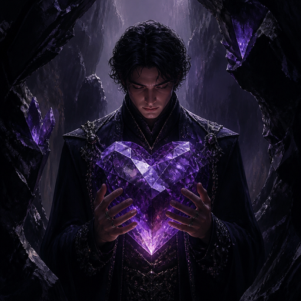
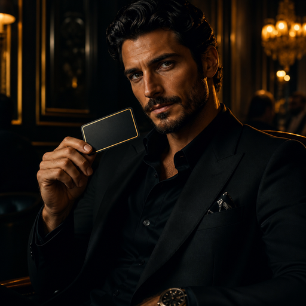

# GoonCards portraits

Illustrated and compositor 512×512 PNG faces live here, one file per catalog id:

`assets/cards/card_*.png`

Launch catalog is **148** unique plates: the original 48 plus 100 lust-set
portraits. The Discord binder, pack reveal, inspect, and dex load these files
via `utils.card_ai.portrait_path` / `utils.card_canvas.load_portrait`.

The **original 48** are unique painterly illustrations (cinematic glam-velvet:
crimson, gold, charcoal). Examples: `card_velvet_vixen.png`, `card_tomass.png`,
`card_freaky_nikki.png`. They are original compositions inspired by house mood,
not cover-crops of raid bosses, Nikki GIFs, or brand banners. No wordmarks,
no "GoonBot" / "18+" text.








The **100 lust-set plates** shipped with the #21 expansion stay compositor-style
(house palettes, not cropped raid art). Do not overwrite those with `--force`
unless you intend to replace them.

## Regenerating

Shipped original-48 art is the illustrated set. The local Pillow compositor in
`utils/card_art.py` is a **last-resort fallback** only (offline, no API key)
so missing files never blank the hub.

```bash
# Fill any missing file with the compositor fallback (does not overwrite)
python3 scripts/generate_card_portraits.py
python3 scripts/generate_card_portraits.py --only-missing

# Try an images API, then compositor for failures
python3 scripts/generate_card_portraits.py --force --ai

# Replace everything with compositor fallbacks (not the illustrated look)
python3 scripts/generate_card_portraits.py --force --procedural-only
```
